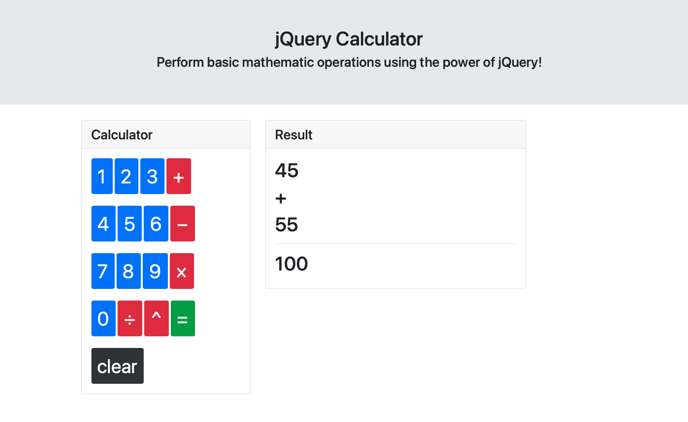

# jQueryCalculator

Basic Calculator using JQuery.

It handles basic mathematical operations like addition, subtraction, multiplication, etc.

GitHub Pages URL: https://luiscontrerasglz.github.io/jQueryCalculator/

